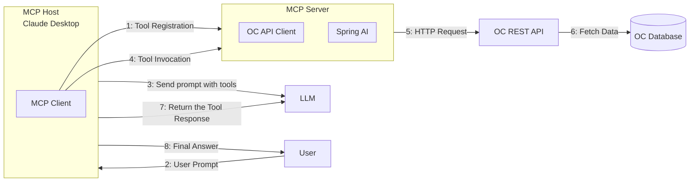

# OpenChallenges MCP Server

## Overview

The OpenChallenges Model Context Protocol (MCP) Server is a Spring Boot application that serves as a bridge between Large Language Models (LLMs) and the OpenChallenges platform. Built with Spring AI and running on port 8887 by default, it provides a set of tools that enable LLMs to access and interact with data through the OpenChallenges ecosystem.

## Architecture

