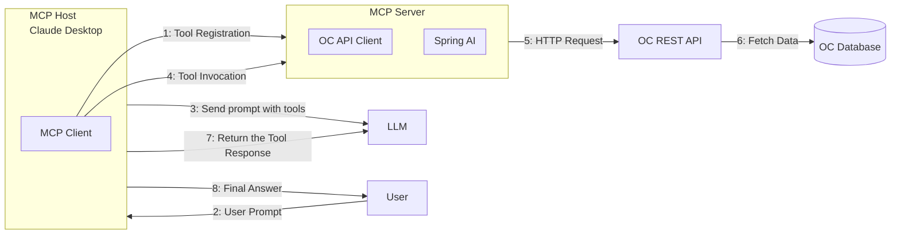

# OpenChallenges MCP Server

## Overview

The OpenChallenges Model Context Protocol (MCP) Server is a Spring Boot application that serves as a bridge between Large Language Models (LLMs) and the OpenChallenges platform. Built with Spring AI and running on port 8887 by default, it provides a set of tools that enable LLMs to access and interact with data through the OpenChallenges ecosystem.

## Architecture



## Quick Start (Docker Compose)

1. Install [Docker](https://docs.docker.com/get-docker/) and [Docker Compose](https://docs.docker.com/compose/install/) (if not already). Confirm installation:
   ```bash
   docker compose version
   ```
2. Download the [standalone compose file](https://github.com/Sage-Bionetworks/sage-monorepo/blob/main/docker/openchallenges/services/mcp-server-standalone.yml): `mcp-server-standalone.yml`
3. Launch the container (adjust the path as needed):

   ```bash
   docker compose -f path/to/mcp-server-standalone.yml up -d
   ```

### Configure MCP Client

#### Claude Desktop (Free Plan)

Use the [`mcp-remote`](https://www.npmjs.com/package/mcp-remote) local proxy to bridge Claude Desktop (free plan) to the remote MCP server. See also the [Cloudflare MCP Remote guide](https://developers.cloudflare.com/agents/guides/remote-mcp-server/#connect-your-remote-mcp-server-to-claude-and-other-mcp-clients-via-a-local-proxy).

1. Install [`mcp-remote`](https://www.npmjs.com/package/mcp-remote) ([Node](https://nodejs.org/en/download) required):

   ```console
   npm i mcp-remote
   ```

2. Configure [Claude Desktop](https://claude.ai/download): Follow the [Claude Desktop User - Get started](https://modelcontextprotocol.io/quickstart/user) guide and add this to your `claude_desktop_config.json`:

   ```json
   {
     "mcpServers": {
       "mcp-server": {
         "command": "npx",
         "args": ["mcp-remote", "http://localhost:8887/mcp-server/sse"]
       }
     }
   }
   ```

3. Restart Claude Desktop. The OpenChallenges MCP tools should now appear and be ready to answer prompts.


#### GitHub Copilot in VS Code

- Follow the [Use MCP tools in agent mode](https://code.visualstudio.com/docs/copilot/chat/mcp-servers#_use-mcp-tools-in-agent-mode) guide.
- Add (or merge) the following entry into `.vscode/mcp.json`:

  ```json
  {
    "servers": {
      "openchallenges-mcp-server": {
        "type": "sse",
        "url": "http://localhost:8887/mcp-server/sse"
      }
    }
  }
  ```

    

#### Other MCP Clients

For other [MCP clients](https://modelcontextprotocol.io/clients) that support connecting to a remote MCP server via Server-Sent Events (SSE), configure a custom SSE endpoint: `http://localhost:8887/mcp-server/sse`. Compatibility beyond Claude Desktop and GitHub Copilot is still experimental.

## Example Prompts

```
What is the next challenge about to launch?
```

```
When does the next Synapse-hosted challenge start?
```

```
How many challenges ran each year?
```

```
List active challenges that accept container image submissions.
```

```
Which organizations hosted challenges in 2023?
```
