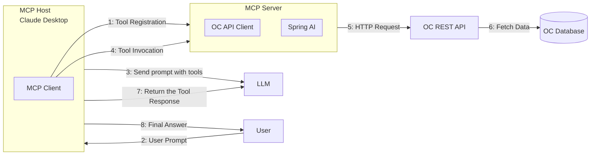

# OpenChallenges MCP Server

The OpenChallenges Model Context Protocol (MCP) Server is a component that enables real-time communication between the OpenChallenges application and its clients using Server-Sent Events (SSE).

## Overview

The MCP Server is configured to run on port 8887 and provides a Server-Sent Events endpoint at `/mcp-server/sse`. It facilitates real-time updates and notifications for the OpenChallenges platform.

## Architecture

Below is the data flow diagram showing how the MCP server interacts with other components:




## Configuration

The MCP server configuration is stored in `.vscode/mcp.json`:

```json
{
  "servers": {
    "openchallenges-mcp-server": {
      "type": "sse",
      "url": "http://localhost:8887/mcp-server/sse"
    }
  }
}
```

## Features

- Real-time event streaming using Server-Sent Events (SSE)
- Bi-directional communication between server and clients
- Event-driven architecture for efficient updates
- Seamless integration with OpenChallenges platform

## Getting Started

1. Make sure the MCP server is running on port 8887
2. Connect to the SSE endpoint at `http://localhost:8887/mcp-server/sse`
3. Start receiving real-time updates from the server

## Related Components

The MCP server is part of the larger OpenChallenges ecosystem and works in conjunction with:

- Challenge Service
- Auth Service
- API Gateway
- Core Service

## Development

For development purposes, ensure you have the following prerequisites:

- Node.js
- Docker environment
- Access to the OpenChallenges development environment

## Contributing

Please refer to the main repository's CONTRIBUTING.md file for guidelines on how to contribute to this project.
