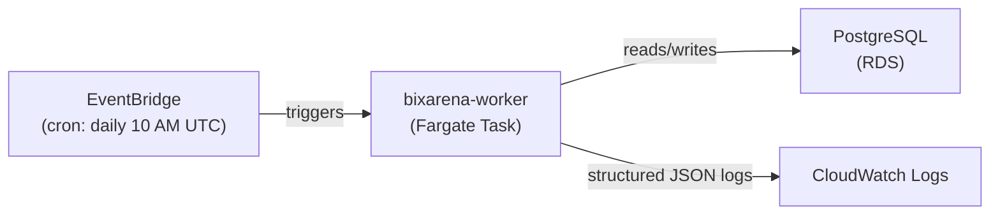

# BixArena Leaderboard Snapshot Automation

## Overview

The BixArena leaderboard is updated daily through an automated snapshot generation pipeline. Each
day, a scheduled task fetches battle evaluation data, computes model rankings using the
Bradley-Terry algorithm, and publishes the results as a new public leaderboard snapshot.

## Architecture

1. EventBridge triggers the `bixarena-worker` Fargate task daily at 10:00 AM UTC
2. The task runs in a private VPC subnet with direct access to the PostgreSQL database
3. The handler generates a leaderboard snapshot and auto-publishes it
4. Structured JSON logs are emitted to CloudWatch for observability



## Components

### Shared Library (`bixarena-leaderboard`)

The core ranking and snapshot generation logic lives in a standalone Python library at
`libs/bixarena/leaderboard/python/`. It provides:

- **Bradley-Terry ranking** — computes model win rates with bootstrap confidence intervals
- **Snapshot generation** — fetches battle evaluations, ranks models, inserts snapshot and entries,
  and sets visibility to `public`

### Worker Container (`bixarena-worker`)

A Python application at `apps/bixarena/worker/` that runs as a one-shot container task. On each
invocation, the handler:

1. Reads configuration from environment variables
2. Calls `generate_snapshot()` from the shared library
3. Emits structured JSON logs with a `correlation_id` for CloudWatch tracing

### CDK Infrastructure (`WorkerStack`)

An ECS Scheduled Fargate Task deployed via AWS CDK. Key resources:

- **EventBridge rule** — triggers the task daily at 10:00 AM UTC
- **Fargate task** — 1 vCPU, 2 GB memory, runs the `bixarena-worker` container image
- **Secrets Manager** — database credentials are injected securely at task start by the ECS agent

## Configuration

The following environment variables control snapshot generation. They are set in CDK and require a
redeployment to change.

| Variable            | Default             | Description                                                                                                |
| ------------------- | ------------------- | ---------------------------------------------------------------------------------------------------------- |
| `LEADERBOARD_SLUG`  | `overall`           | Slug of the leaderboard to snapshot. Must match a slug that exists in the database — validated at runtime. |
| `NUM_BOOTSTRAP`     | `1000`              | Number of bootstrap iterations for Bradley-Terry confidence interval computation.                          |
| `MIN_EVALS`         | `10`                | Minimum number of battle evaluations a model must have to be included in the snapshot.                     |
| `SIGNIFICANT`       | `false`             | If `true`, only include models with statistically significant rankings.                                    |
| `POSTGRES_HOST`     | _(from RDS)_        | Injected automatically by CDK from the RDS endpoint.                                                       |
| `POSTGRES_PORT`     | _(from RDS)_        | Injected automatically by CDK from the RDS endpoint.                                                       |
| `POSTGRES_DB`       | `bixarena`          | Database name.                                                                                             |
| `POSTGRES_USER`     | _(Secrets Manager)_ | Injected securely at task start by the ECS agent.                                                          |
| `POSTGRES_PASSWORD` | _(Secrets Manager)_ | Injected securely at task start by the ECS agent.                                                          |

To change a value: update the relevant `app.py` for the target environment and redeploy:

```bash
nx run bixarena-infra-cdk:deploy:[dev|stage|prod]
```

## Manual Trigger

Developers can generate a snapshot on demand by opening an SSH tunnel to the target RDS instance
and invoking the handler locally:

```bash
# 1. Open SSH tunnel to RDS
nx run bixarena-infra-cdk:start-db-tunnel [dev|stage|prod]

# 2. Configure DB credentials in apps/bixarena/worker/.env

# 3. Run the handler locally
nx run bixarena-worker:invoke
```

## Deferred Features

The following features were planned in [RFC-0001](../rfcs/0001-bixarena-leaderboard-snapshot-automation-plan.md) but deferred to a future admin dashboard release:

- **On-demand trigger** — API endpoint to manually trigger snapshot generation ([ADR-0002](../adr/0002-defer-notifications-and-admin-api.md))
- **Notifications** — SNS/Slack alerts on task success or failure ([ADR-0002](../adr/0002-defer-notifications-and-admin-api.md))

## Related Documents

- [RFC-0001](../rfcs/0001-bixarena-leaderboard-snapshot-automation-plan.md): Original proposal
- [ADR-0001](../adr/0001-scheduled-fargate-over-lambda.md): Fargate vs Lambda decision
- [ADR-0002](../adr/0002-defer-notifications-and-admin-api.md): Deferred features
