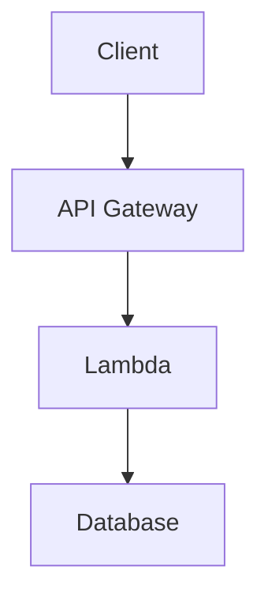

# Architecture Diagrams

This directory contains visual diagrams for system architecture and design documentation.

## Supported Formats

- **GIF** (`.gif`) - Animated diagrams, flowcharts
- **PNG** (`.png`) - Static images, screenshots
- **SVG** (`.svg`) - Scalable vector graphics (preferred for diagrams)
- **HTML** (`.html`) - Interactive diagrams (e.g., Mermaid, PlantUML exports)

## Current Diagrams

- [bixarena-architecture.gif](./bixarena-architecture.gif) - Current BixArena system architecture
- [bixarena-architecture-v1.gif](./bixarena-architecture-v1.gif) - Previous version

## Guidelines

- **Naming convention**: Use kebab-case with dashes (e.g., `feature-name-architecture.svg`)
- Use descriptive filenames that clearly identify the system or component
- Include version numbers for major revisions (e.g., `bixarena-architecture-v2.svg`)
- Prefer SVG for diagrams (better for version control and scaling)
- Update the parent [README.md](../README.md) when adding new diagrams
- Keep source files (e.g., `.drawio`, `.mmd`) in a separate `source/` subdirectory if needed

## Creating Diagrams

**Recommended Tools**:

- [Mermaid](https://mermaid.js.org/) - Text-based diagrams (can be embedded in markdown)
- [Excalidraw](https://excalidraw.com/) - Hand-drawn style diagrams
- [draw.io](https://app.diagrams.net/) - Professional diagrams
- [PlantUML](https://plantuml.com/) - UML diagrams from text

**Mermaid Example** (embed directly in markdown):

**For Complex Diagrams**:

1. Create diagram using your preferred tool
2. Export as SVG (preferred) or PNG
3. Save in this directory
4. Reference from architecture docs using relative path
