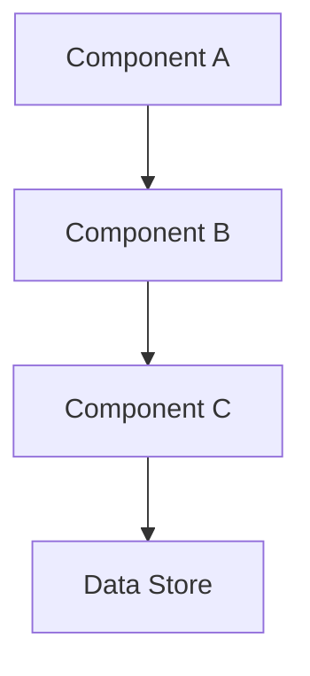

# [Architecture Plan Title]

## Overview

[High-level description of what this architecture implements]

[Brief summary of the key components and their interactions]

## Related Documentation

- **Source RFC**: [Link to RFC if this originated from one]
- **Related ADRs**: [Links to relevant Architecture Decision Records]

## Architecture Diagram

[Include a diagram showing the system architecture. You can use:]

- Mermaid diagrams (embedded in markdown)
- Static images from `diagrams/` directory (`.gif`, `.png`, `.svg`)
- ASCII art for simple diagrams

Example Mermaid diagram:



Example static image:

```markdown

```

**Design Notes:**

- [Key architectural decisions]
- [Important constraints or considerations]
- [Extensibility points]

---

## Security Architecture

### Overview

[High-level security approach and principles]

### Security Measures by Component

#### Component 1

[Security considerations and implementation]

#### Component 2

[Security considerations and implementation]

### Secrets Management

[How sensitive data is stored and accessed]

### Network Security

[VPC configuration, security groups, network isolation]

### Authentication & Authorization

[How users/services are authenticated and authorized]

### Audit & Compliance

[Logging, monitoring, and compliance considerations]

---

## Implementation Details

### Component 1: [Name]

**Purpose**: [What this component does]

**Technology**: [Language, framework, service]

**Key Files**:

- `path/to/file1.py` - [Description]
- `path/to/file2.ts` - [Description]

**Implementation**:

[Detailed implementation notes, code examples, configuration]

### Component 2: [Name]

[Similar structure as Component 1]

---

## Database Schema

### Tables

#### `table_name`

[Description of the table]

**Columns**:

| Column       | Type           | Constraints             | Description        |
| ------------ | -------------- | ----------------------- | ------------------ |
| `id`         | `bigint`       | PRIMARY KEY             | Unique identifier  |
| `name`       | `varchar(255)` | NOT NULL                | [Description]      |
| `created_at` | `timestamp`    | NOT NULL, DEFAULT NOW() | Creation timestamp |

**Indexes**:

- `idx_name` on `(column1, column2)` - [Purpose]

**Relationships**:

- Foreign key to `other_table.id`

---

## Infrastructure (CDK/Terraform)

### AWS Resources

[List of AWS resources to be created]

### CDK Stack Structure

```
apps/[product]/infra/cdk/
├── lib/
│   └── [product]-leaderboard-snapshot-stack.ts
└── README.md
```

### Key CDK Constructs

[Code examples showing CDK construct definitions]

---

## Configuration

### Environment Variables

| Variable       | Description                  | Example            | Required |
| -------------- | ---------------------------- | ------------------ | -------- |
| `DATABASE_URL` | PostgreSQL connection string | `postgresql://...` | Yes      |
| `FEATURE_FLAG` | Enable feature               | `true`             | No       |

### Secrets (AWS Secrets Manager)

| Secret Name                | Description          | Format                                             |
| -------------------------- | -------------------- | -------------------------------------------------- |
| `[product]/db/credentials` | Database credentials | JSON: `{username, password, host, port, database}` |

---

## Error Handling & Monitoring

### Error Handling Strategy

[How errors are caught and handled]

### Logging

[What is logged and where]

### Metrics

[Key metrics to monitor]

### Alerts

[What alerts should be configured]

### Notifications

[How teams are notified of issues]

---

## Testing Strategy

### Unit Tests

[What should be unit tested]

### Integration Tests

[What should be integration tested]

### End-to-End Tests

[What should be tested end-to-end]

### Manual Testing

[Steps for manual verification]

---

## Deployment Plan

### Prerequisites

- [ ] Prerequisite 1
- [ ] Prerequisite 2

### Phase 1: [Phase Name]

**Timeline**: [Date range]

**Steps**:

1. Step 1
2. Step 2

**Validation**:

- [ ] Validation criterion 1
- [ ] Validation criterion 2

### Phase 2: [Phase Name]

[Similar structure as Phase 1]

### Rollback Plan

[How to rollback if issues occur]

---

## Migration Plan (if applicable)

### Data Migration

[How existing data will be migrated]

### Backwards Compatibility

[How to maintain compatibility during transition]

### Migration Validation

[How to verify migration success]

---

## Performance Considerations

### Expected Load

[Expected traffic/usage patterns]

### Scalability

[How the system scales]

### Performance Targets

- Response time: [Target]
- Throughput: [Target]
- Availability: [Target]

### Bottlenecks

[Potential performance bottlenecks and mitigation strategies]

---

## Cost Analysis

### Estimated Monthly Costs

| Resource           | Cost   | Justification |
| ------------------ | ------ | ------------- |
| Lambda invocations | $X     | [Calculation] |
| Data storage       | $Y     | [Calculation] |
| **Total**          | **$Z** |               |

### Cost Optimization

[Strategies to minimize costs]

---

## Future Enhancements

[Potential future improvements or extensions]

1. Enhancement 1
2. Enhancement 2

---

## Open Questions

[Questions that need to be resolved during implementation]

1. Question 1?
2. Question 2?

---

## References

- [Link to related documentation]
- [Link to external resources]
- [Link to related PRs/issues]
