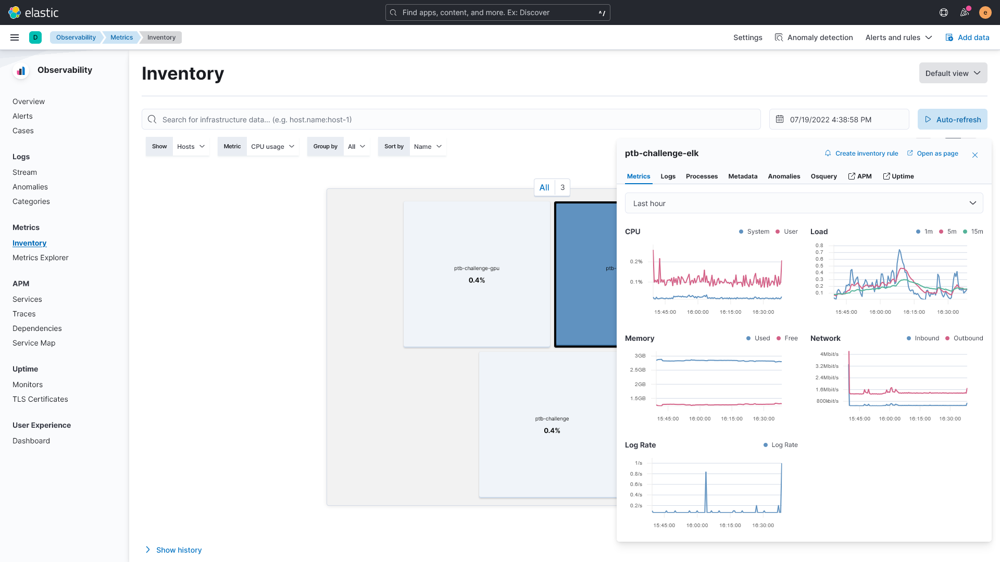
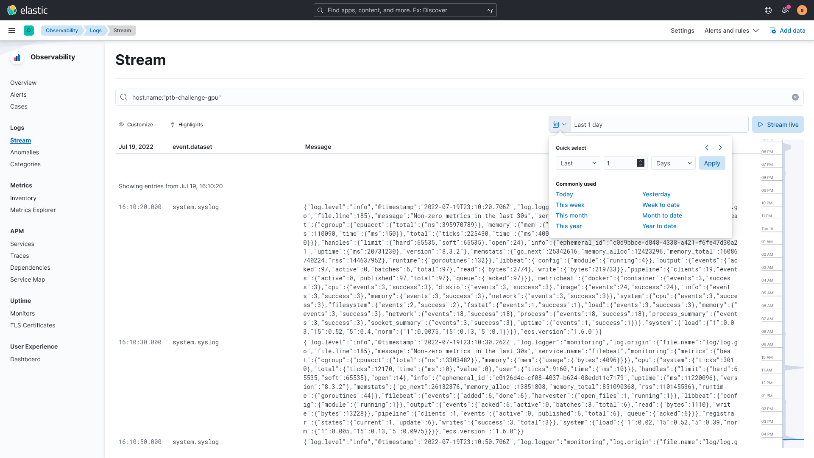
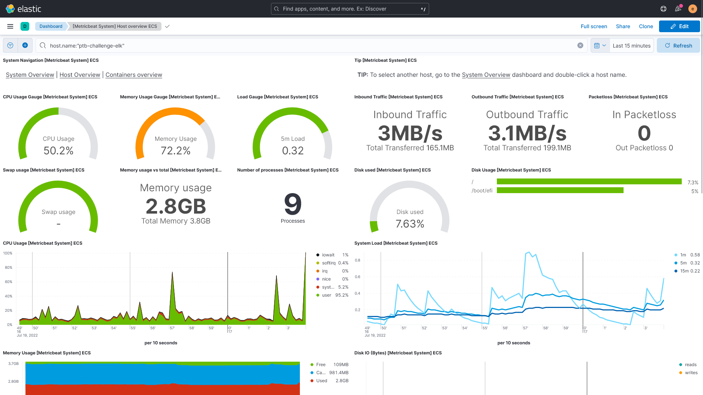
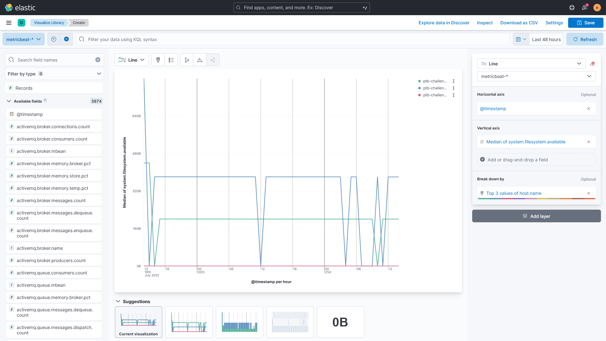

# Collect Challenge Logs and System Metrics

## Overview

This document describes how to centralize and explore the logs and system metrics generated by a
fleet of hosts (EC2 instances) and Docker containers. The instructions are provided in the context
of monitoring hosts and containers during a scientific challenge organized by Sage Bionetworks.

## Objectives

The solution described here offers a single, user-friendly interface to monitor logs and visualize
system metrics generated by a fleet of hosts and containers. This solution contributes to

- **Enhanced security**
  - Quickly access to network usage (in/out).
  - Set alerts.
    - E.g., send an email notification when unusual inbound and/or outbound network traffic occur.

- **Improved stability**
  - Quickly access system health information.
  - Set alerts.
    - E.g., send an email notification when the filesystem of a host is almost filled to its
      capacity, which can lead to a crash of the system. The alert enables an engineer to
      preemptively increase the available storage space.

- **Better engineer experience**
  - A single, user-friendly dashboard enables the engineer in charge of monitoring the system to
    quickly access logs and system health information.

- **Enhanced reporting**
  - Collect and visualize information about how the system is used. This data can help to better
    understand the needs of the users and better dimension the system to cut costs.

In the context of the organization of a scientific challenge, the collected data aim to answer the
following questions:

- Are all the EC2 instances up?
- Is an instance at risk of crashing because its storage capacity is nearly filled up?
- Are submissions using all the CPU cores available?
- Are submissions using the GPU cores available?
- Is a submission crashing due to a memory leak (memory usage, logs)?
- Is a submission generating too much data (logs, scratch/pre-processed/output files)
- What fraction of the uptime of an EC2 instance is used to process submissions?
  - How much money could we have saved using on-demand EC2 instances?

## Architecture


The components of the stack are:

- `challenge-elk`: EC2 instance that runs the [ELK stack]
- `challenge-node-*`: EC2 instances that run Beat agents (Metricbeat, Filebeat).

> **Note**
> Instructions on how to deploy and use this monitoring solution are given below. The instructions are
given in the context of monitoring a stack used to process submissions received during a scientific
challenge. However, this solution can be used to monitor hosts and containers deployed for other
applications.

## Authors

Please give credit to the following persons if you are using or building on top of this solution.

- [Thomas Schaffter](https://github.com/tschaffter)
- [Verena Chung](https://github.com/vpchung)

---

## Contents

1. [Requirements](#requirements)
2. [Deploy the ELK Stack](#deploy-the-elk-stack)
    - [Create the EC2 instance](#create-the-ec2-instance)
    - [Connect to the instance](#connect-to-the-instance)
      - [SSM with SSH](#ssm-with-ssh)
    - [Prepare the instance](#prepare-the-instance)
    - [Configure the ELK Stack](#configure-the-elk-stack)
    - [Start the ELK Stack](#start-the-elk-stack)
    - [Connect to Kibana](#connect-to-kibana)
3. [Deploy Beat agents](#deploy-beat-agents)
    - [Metricbeat](#metricbeat)
    - [Filebeat](#filebeat)
    - [Set up Beat assets](#set-up-beat-assets)
4. [Explore and visualize data in Kibana](#explore-and-visualize-data-in-kibana)
    - [Inventory](#inventory)
    - [Logs Stream](#logs-stream)
    - [Dashboards](#dashboards)
      - [[Metricbeat System] Overview ECS](#metricbeat-system-overview-ecs)
    - [Discover](#discover)
5. [Improvements and future activities](#improvements-and-future-activities)

## Requirements

- 1 EC2 instance where the [ELK Stack] will be deployed.
  - This instance requires the Docker Engine (see [ELK Stack host requirements]).
- N EC2 instances to monitor using Beat agents (Metricbeat, Filebeat).

## Deploy the ELK Stack

### Create the EC2 instance

Create an EC2 instance in the AWS account `CnbAccount` with the following specifications.

> **Note**
> `CnbAccount` represents the AWS account of the Challenge & Benchmarking group at Sage.

- **Name and tags**
  - Name: `<challenge name>-elk` (e.g. `ptb-challenge-elk`)
  - Tags:
    - `Department`: `CNB`
    - `Project`: `challenge` (selected from [this
      list](https://github.com/Sage-Bionetworks-IT/organizations-infra/blob/master/sceptre/scipool/sc-tag-options/internal/Projects.json))
    - `CostCenter`: select value from [these
      lists](https://github.com/Sage-Bionetworks/aws-infra/tree/master/templates/tags)

- **Application and OS Images (Amazon Machine Image)**
  - Amazon Machine Image (AMI): `Ubuntu Server 22.04 LTS (HVM), SSD Volume Type`
  - Architecture: `64-bit (x86)`

- **Instance type**
  - Instace type: `t2.medium`
    > **Note**
    > The instance needs at least 2 vCPUs and 4 GB of memory.

- **Key pair**
  - Select your SSH key pair or create a new one.

- **Network settings**
  - Click on `Edit`
  - VPC: `vpc-0a70996f3e816e067`
  - Subnet: `subnet-01898b708714fa3b6`
  - Firewall
    - Select `Select existing security group`.
    - Select `sg-0807a0e374542affd (cnbvpc-VpnSecurityGroup-JBXT9AUVDXCA)`.

  > **Note** These values will be different if you are creating the EC2 instance from an AWS account
  > different from `CnbAccount`.

- **Configure storage**
  - 1x 100 GB gp2

Once the instance has been created, configure it to use the following IAM:

- Go to `EC2` > `Instances`.
- Select the ELK instance.
- Click on the button `Actions` > `Security` > `Modify IAM role`.
- Select the IAM role `AmazonSSMRoleForInstancesQuickSetup`.

### Connect to the instance

Use the [AWS Systems Manager Agent (SSM Agent)] to connect to the EC2 instance. If this is your
first time ever connecting to an instance created by the CnbAccount AWS account, complete the
following step first. Otherwise, skip to steps 2 and 3.

1. Create an `~/.aws/config` file if you do not already have one. Add the following:
    ```console
    [profile cnb]
    region = us-east-1
    sso_start_url = https://d-906769aa66.awsapps.com/start
    sso_region = us-east-1
    sso_account_id = 216152803258
    sso_role_name = Administrator
    output = json
    ```
    This will create a named AWS profile called `cnb`.

2. Before connecting to any `cnb` instances, first login to AWS SSO:
    ```console
    aws --profile cnb sso login
    ```
   A browser window will pop up, asking for access from an application. Click `Allow`. You are now
   authenticated for remote access for the next 8-10 hours. Re-login as necessary.

3. Connect to the instance as `ubuntu`, passing the `Instance ID` to `--target`:
    ```console
    aws ssm start-session \
      --profile cnb \
      --document-name AWS-StartInteractiveCommand \
      --parameters command="sudo su - ubuntu" \
      --target <instance id>
    ```

#### SSM with SSH

Follow these instructions to connect to the instance via SSH using the command `ssh <profile name>`.

1. Add a new profile to the `~/.ssh/config` file.
    ```console
    Host <challenge name>-elk
      HostName i-0fad4cb3e6543283e
      User ubuntu
      IdentityFile ~/.ssh/<your pem file>
      ProxyCommand sh -c "AWS_PROFILE=cnb aws ssm start-session --target %h --document-name AWS-StartSSHSession --parameters 'portNumber=%p'"
    ```

2. Copy the public portion of your SSH key (on your local computer) to the instance’s
   `~/.ssh/authorizedkeys` file.

3. Set the permission of the authorizedkeys file to 600.
    ```console
    chmod 600 ~/.ssh/authorizedkeys
    ```

4. Connect to the instance.
    ```console
    ssh <challenge name>-elk
    ```

### Prepare the instance

1. Start by updating the system packages on the instance. System packages should be regularly
   updated for enhanced security. On Ubuntu,
    ```console
    sudo apt update
    sudo apt upgrade -y
    ```

2. [Install the Docker Engine].
    - [Enable the non-root user to execute Docker commands].
    - Enable the Docker Engine to start at startup.
      ```console
      sudo systemctl enable docker
      ```

3. We will use the hostname of the EC2 instances to filter logs and metrics in Kibana. Therefore, it
   is recommended to use short and descriptive hostnames. To update the hostname of an EC2 instance:
    - Open the file `/etc/hostname`.
    - Set the hostname to `<challenge name>-elk`. For example, `ptb-challenge-elk` for the instance
      running the ELK stack for the Preterm Birth Prediction DREAM Challenge, and
      `ptb-challenge-node-<uuid>` for instances that process challenge submissions.

### Configure the ELK Stack

1. Clone the GH repository of the ELK stack.
    ```console
    git clone --depth 1 https://github.com/Sage-Bionetworks/docker-elk.git
    ```

2. Configure the ELK stack.
    - [Disable paid features](https://github.com/Sage-Bionetworks/docker-elk#how-to-disable-paid-features).
    - Set new passwords in `.env`.

      > **Note** Create new passwords using the password generator that should come with your
      > favorite password manager.

      Save the new passwords in Sage password manager.

### Start the ELK Stack

Start the ELK stack services using Docker Compose:

```console
docker compose up -d
```

> **Note**
> The stack can be stopped with `docker compose stop` and restarted with `docker compose start`.

### Connect to Kibana

[Kibana] (the "K" in ELK) is a free and open user interface that lets you visualize your
Elasticsearch data and navigate the Elastic Stack.

To access Kibana, start by forwarding the Kibana port (5601) to your localhost using AWS SSM.

```console
$ AWS_PROFILE=cnb aws ssm start-session --target <instance id> --document-name AWS-StartPortForwardingSession --parameters '{"portNumber":["5601"], "localPortNumber":["5601"]}'

Starting session with SessionId: ...
Port 5601 opened for sessionId ...
Waiting for connections...
```

> **Note** For developers of the Challenge Registry, VS Code is already forwarding the port 5601 to
> localhost when running the project dev container. Either make sure that the dev container is not
> running when accessing Kibana or forward the Kibana port to another port on localhost, e.g. with
> `--parameters '{"portNumber":["5601"], "localPortNumber":["56010"]}'` (notice the trailing `0`).

Give Kibana about 2-3 minutes to initialize after having started it, then access the Kibana web UI
by opening `http://localhost:5601` in a web browser and use the following (default) credentials
to log in:

- user: `elastic`
- password: `<elastic password>`

## Deploy Beat agents

### Metricbeat

[Metricbeat] is a Elastic Beat agent that we will deploy on all the EC2 instances, including the
instance that runs the ELK stack, to monitor the following metrics: CPU usage, memory usage,
filesystem usage, and network usage. Metricbeat will send this information at the host and Docker
container levels.

1. Ssh to an EC2 instance.
2. [Install Metricbeat].
    > **Note** The version of Metricbeat must match the version of the ELK stack. The version of the
    > ELK stack is specified in the configuration file `.env` of the ELK stack.

3. Enable the Metricbeat `docker` module.
    ```console
    sudo metricbeat modules enable docker
    ```

4. Check that the following modules are enable: `system`, `docker`.
    ```console
    sudo metricbeat modules list
    ```

5. Specify the IP address and credentials that Metricbeat must use to connect to the EKL stack.
    - Open the Metricbeat configuration file `/etc/metricbeat/metricbeat.yml`.
    - Update the configuration for the section `output.elasticsearch`.
      ```console
      output.elasticsearch:
        hosts: ["<elasticsearch ip>:9200"]
        username: "elastic"
        password: "<elastic password>"
      ```

6. Update the metrics that the `docker` module should capture.
    - Open the `docker` module configuration file `/etc/metricbeat/modules.d/docker.yml`.
    - Use the following configuration:
      ```console
      - module: docker
        metricsets:
          - container
          - cpu
          - diskio
          - event
          - healthcheck
          - image
          - info
          - memory
          - network
        #  - network_summary
        period: 10s
        hosts: ["unix:///var/run/docker.sock"]
      ```

7. Enable Metricbeat to start at startup.
    ```console
    sudo systemctl enable metricbeat
    ```

8. Start Metricbeat.
    ```console
    sudo systemctl start metricbeat
    ```

9. Check that Metricbeat has successfully started.
    ```console
    sudo systemctl status metricbeat
    ```
    Look at the logs for any error messages. If Metricbeat failed to start, try restarting it with
    `sudo systemctl restart metricbeat`.

Metricbeat should now be sending data to the ELK Stack!

### Filebeat

[Filebeat] is a Elastic Beat agent that we will deploy on all the EC2 instances, including the
instance that runs the ELK stack, to monitor system log files.

1. Ssh to an EC2 instance.
2. [Install Filebeat].
    > **Note** The version of Filebeat must match the version of the ELK stack. The version of the
    > ELK stack is specified in the configuration file `.env` of the ELK stack.

3. Enable the Filebeat `system` module.
    ```console
    sudo filebeat modules enable system
    ```

4. Check that the following modules are enable: `system`.
    ```console
    sudo filebeat modules list
    ```

5. Specify the IP address and credentials that Filebeat must use to connect to the EKL stack.
   - Open the Filebeat configuration file `/etc/filebeat/filebeat.yml`.
   - Update the configuration for the section `output.elasticsearch`.
      ```console
      output.elasticsearch:
        hosts: ["<elasticsearch ip>:9200"]
        username: "elastic"
        password: "<elastic password>"
      ```

6. Update the metrics that the `system` module should capture.
    - Open the `system` module configuration file `/etc/filebeat/modules.d/system.yml`.
    - Use the following configuration:
      ```console
      - module: system
        syslog:
          enabled: true
      ```

7. Enable Filebeat to start at startup.
    ```console
    sudo systemctl enable filebeat
    ```

8. Start Filebeat.
    ```console
    sudo systemctl start filebeat
    ```

9. Check that Filebeat has successfully started.
    ```console
    sudo systemctl status filebeat
    ```
    > **Note** Look at the logs for any error messages. If Filebeat failed to start, try restarting
    > it with `sudo systemctl restart metricbeat`.

Filebeat should now be sending data to the ELK Stack!

### Set up Beat assets

Beats such as Metricbeat and Filebeat comes with predefined assets for parsing, indexing, and
visualizing your data. To load these assets, run the following commands from the EC2 instance
that runs the ELK stack.

```console
metricbeat setup -e --dashboards
filebeat setup -e --dashboards
```

## Explore and visualize data in Kibana

After logging in Kibana, try to access the following sections to start exploring and monitoring the
data sent to the ELK stack.

### Inventory

This page shows the compute resources used by all the hosts (EC2 instances) and Docker containers.
To open the Inventory,

1. Click on the top-left menu button.
2. Click on `Observability` > `Metrics`.

Each host is represented by a tile in the Inventory. Click on one of the hosts to quickly access
information about CPU, memory and network usage. The same dialog gives access to the following
information:

- Tab `Logs`: access the logs generated by the host (sent by Filebeat).
- Tab `Processes`: see the list of processes running on the host.
- Tab `Metadata`: see host metadata such as OS distrubution name and version, architecture, etc.



To display similar information for the running Docker containers, set the value of the menu `Show`
to `Docker Containers`. The tiles shown now represent the Docker containers running across all the
hosts. Use the search bar to filter hosts and containers. For example, enter `host.hostname:
ptb-challenge-gpu` to show only the containers running on the host `ptb-challenge-gpu`.

### Logs Stream

This page shows the logs generated by all the hosts and sent by Filebeat to the ELK stack. To open
the Logs Stream,

1. Click on the top-left menu button.
2. Click on `Observability` > `Logs`.



### Dashboards

Earlier, we initialized the ELK Stack with Beats assets, which include several dashboards that we
can use to monitor the fleet of hosts and containers. Here is a list of dashboards that are useful
for monitoring the challenge hosts and containers.

To access the complete list of dashboards,

1. Click on the top-left menu button.
2. Click on `Analytics` > `Dashboard`.

#### [Metricbeat System] Overview ECS

This dashboard provides an overview of system metrics such as CPU, memory, network and filesystem
usage. By default, the dashboard displays information aggregated across all the hosts and Docker
containers. A filter can be specified to display data for a single host. For example, by specifying
the filter `host.name:"<instance hostname>"`.



## Discover

The Discover page enables us to quickly explore all the data indexed in the ELK stack.

To access the Discover page,

1. Click on the top-left menu button.
2. Click on `Analytics` > `Discover`.

For example, we want to visualize the evolution of the available filesystem of all the hosts. This
information is important when troubleshooting the crash of an host as it is possible that the crash
occurred because the filesystem was filled up to its capacity.

On the Discovery page,

1. Click on the top-left button included in the Discovery page, select the index `metricbeat-*`.
2. In the `Search field names` input, enter `system.filesystem.available`.
3. In the list of available fields, click on `system.filesystem.available`, then click on the
   button `Visualize`.

4. In the right panel, set the following properties:
    - Horizontal axis: `@timestamp`
    - Vertical axis: `Median of system.filesystem.available`
    - Break down by: `host.name`

5. Generate a line plot by selecting `Line` after clicking on one of the menu button above the plot.

You should now be able to see a view similar to the one shown below.



From there, the following actions are available:

- Download the plot data in CSV format Click by clicking on the button `Download as CSV`.
- Save the plot to access it later by clicking on the button `Save`.

## Improvements and future activities

- Configure the ELK stack to use https connections.
  - when the user connects to Kibana
  - when the Beat agents pushes data to Elasticsearch/Logstash
- Deploy the Beat agents using Docker.
- Configure the `aws` module of Metricbeat to collect CloudWatch data, including billing
  information.
- Create a custom dashboard in Kibana that shows all the information relevant.
- Collect logs generated by the Challenge Orchestrator.
- Collect GPU usage.
    - The Beat [Nvidiagpubeat] only supports ELK v6 and v7. We are currently using ELK v8.3.0.
- Develop a custom Beat to collect information specific to our projects. For instance, a Beat that
  sends information about the number of submission in a queue to the ELK stack.
    - See [Community Beats].

<!-- Links -->

[ELK stack]: https://www.elastic.co/what-is/elk-stack
[deviantony/docker-elk]: https://github.com/deviantony/docker-elk
[Sage-Bionetworks/docker-elk]: https://github.com/Sage-Bionetworks/docker-elk
[Install the Docker Engine]: https://docs.docker.com/engine/install/ubunt
[Enable the non-root user to execute Docker commands]: https://docs.docker.com/engine/install/linux-postinstall/#manage-docker-as-a-non-root-user
[Metricbeat]: https://www.elastic.co/beats/metricbeat
[Install Metricbeat]: https://www.elastic.co/guide/en/beats/metricbeat/current/metricbeat-installation-configuration.html#install
[Filebeat]: https://www.elastic.co/beats/filebeat
[Install Filebeat]: https://www.elastic.co/guide/en/beats/filebeat/current/filebeat-installation-configuration.html#installation
[Kibana]: https://www.elastic.co/kibana/
[AWS Systems Manager Agent (SSM Agent)]: https://docs.aws.amazon.com/systems-manager/latest/userguide/ssm-agent.html
[steps 1-4 of SSM with SSH]: https://help.sc.sageit.org/sc/Service-Catalog-Provisioning.938836322.html#ServiceCatalogProvisioning-SSMwithSSH
[Nvidiagpubeat]: https://github.com/eBay/nvidiagpubeat
[Community Beats]: https://www.elastic.co/guide/en/beats/libbeat/current/community-beats.html
[ELK Stack host requirements]: https://github.com/Sage-Bionetworks/docker-elk#host-setup
