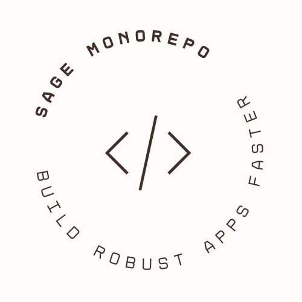

---

Get started with Sage Monorepo, learn the fundamentals and explore advanced topics.

- [Overview of Sage Monorepo]
- Cheat Sheet (coming soon)
- [Docs](docs)

## Development Setup

### Requirements

- [Docker Engine] OR [GitHub Codespace]
- [Visual Studio Code]

### Open Sage Monorepo in VS Code

**Option 1**: Click on the button shown below to open Sage Monorepo in its [development container]
with VS Code. This option is suitable if you want to explore the content of Sage Monorepo.

[](https://vscode.dev/redirect?url=vscode://ms-vscode-remote.remote-containers/cloneInVolume?url=https://github.com/Sage-Bionetworks/sage-monorepo 'Open in VS Code Dev Containers')

**Option 2**: If you plan to contribute to this project, please [create a fork] and use its URL for
cloning. For more information on contributing and/or our Forking Workflow, see
[CONTRIBUTING.md](CONTRIBUTING.md).

<!-- termynal -->
```console
$ git clone --filter=blob:none <fork url>
---> 100%
Resolving deltas: 100% (...), done.
```

Then open your fork repo inside our dev container using these instructions:

- [Developing inside a Container](./docs/devcontainer.md)
- [Develop on a remote host](./docs/develop-on-a-remote-host.md) (optional)

## Ecosystem

- Java
- Node.js
- Python
- R


## Projects

- OpenChallenges
- Schematic (evaluation)
- Synapse (evaluation)

---

Love Sage Monorepo and its projects? Give our repo a star ⭐.

<!-- Links -->

[docker engine]: https://docs.docker.com/get-docker/
[visual studio code]: https://code.visualstudio.com/
[apache license 2.0]: https://github.com/Sage-Bionetworks/sage-monorepo/blob/main/LICENSE.txt
[GitHub Codespace]: https://github.com/features/codespaces
[Overview of Sage Monorepo]: https://docs.google.com/document/d/12oA-Uol_NsWUtC9LHlAlpcgZXXY9jkxFXqK2EMF96XM
[Code of Conduct]: CODE_OF_CONDUCT.md
[contributing]: CONTRIBUTING.md
[development container]: https://containers.dev/
[create a fork]: https://github.com/Sage-Bionetworks/sage-monorepo/fork
