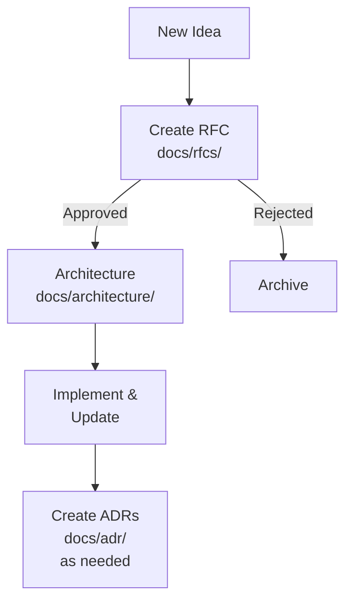

# Documentation

This directory contains technical documentation for the Sage monorepo.

## Documentation Structure

### [RFCs (Request for Comments)](rfcs/README.md)

Proposals for significant system changes that require review and feedback.

- **Purpose**: Gather feedback on proposed designs before implementation
- **Audience**: All stakeholders (engineering, product, architecture)
- **Lifecycle**: Proposed → Approved/Rejected → Moved to Architecture/Archived

### [Architecture](architecture/README.md)

Approved architecture plans, design documents, and system diagrams.

- **Purpose**: Document approved designs and system architecture
- **Audience**: Engineers implementing features, new team members
- **Lifecycle**: Living documents updated as implementation evolves
- **Diagrams**: Stored in `architecture/diagrams/` (supports .gif, .png, .svg, .html)

### [ADRs (Architecture Decision Records)](adr/README.md)

Lightweight records of specific architectural decisions.

- **Purpose**: Capture context and rationale for technical decisions
- **Audience**: Current and future engineers
- **Lifecycle**: Immutable once accepted (superseded by new ADRs if needed)

## Documentation Workflow

**Note on workflow**: While the diagram shows a linear progression, in practice you may draft architecture plans while developing your RFC to clarify your thinking. However, **only submit the RFC for initial review**. The detailed architecture plan should be formalized and moved to `docs/architecture/` only after the RFC is approved. This keeps the review process focused and avoids investing heavily in implementation details before gaining consensus on the approach.

## Quick Links

- [Active RFCs](rfcs/README.md#active-rfcs)
- [Architecture Diagrams](architecture/README.md#architecture-diagrams)
- [Architecture Decisions](adr/README.md#active-adrs)

## Contributing

1. **Proposing Changes**: Create an RFC for significant features or system changes
2. **Recording Decisions**: Create an ADR for specific technical decisions
3. **Updating Docs**: Keep architecture documents current as implementation evolves

## Guidelines

- Use clear, concise language
- Include diagrams where helpful (store in `architecture/diagrams/`)
- Link to related documents and issues
- Keep documents up-to-date
- Follow the templates provided in each directory
