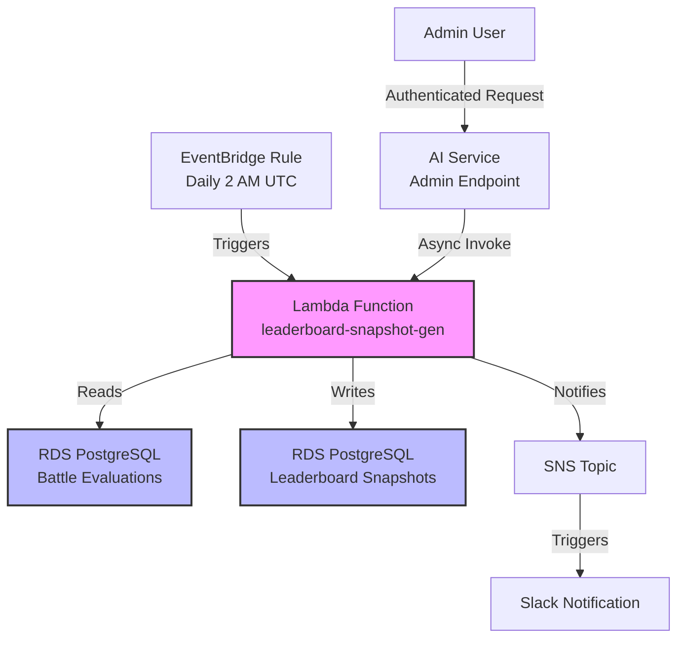

# BixArena Leaderboard Snapshot Automation

## Metadata

- **Status**: Proposed
- **Author**: Thomas Schaffter
- **Created**: 2026-01-09
- **Last Updated**: 2026-01-12

## Summary

Automate the daily generation of BixArena leaderboard snapshots using AWS Lambda and EventBridge scheduling, eliminating the manual process and improving system security by removing the need for external database access via SSH tunneling.

## Motivation

### Problem Statement

The BixArena leaderboard snapshot generation currently requires manual intervention by engineering team members. This manual process involves:

1. Setting up SSH port forwarding via AWS SSM to a bastion host
2. Running a Python script from `bixarena-tools` that connects directly to the production database
3. Generating the leaderboard snapshot from battle evaluation data
4. Publishing the snapshot to make it visible to users

This process must be repeated each time a leaderboard update is needed, consuming engineering resources and limiting how frequently leaderboards can be updated.

### Current State

- **Process**: Manual execution of Python script from `bixarena-tools`
- **Frequency**: Ad-hoc, dependent on engineer availability (typically Rong)
- **Database Access**: Direct connection from development environment via AWS SSM port forwarding through bastion host
- **Security**: Database accessible from outside the private network (via tunneling)
- **Reliability**: Dependent on manual execution, prone to being forgotten or delayed

### Desired State

- **Process**: Fully automated, scheduled execution
- **Frequency**: Predictable daily updates at consistent times
- **Database Access**: Lambda functions running within VPC private subnets
- **Security**: Database connections confined to private network, no external access required
- **Reliability**: Guaranteed daily execution with monitoring and alerting

### Business Impact

**Credibility Risk**: Infrequent or irregular leaderboard updates can negatively impact BixArena's credibility with users who expect to see current rankings reflecting recent battles and evaluations.

**User Engagement**: Stale leaderboards reduce user engagement and confidence in the platform's activity level.

**Engineering Efficiency**: Manual process consumes engineering time that could be better spent on feature development.

## Proposal

### Overview

Implement automated daily leaderboard snapshot generation using a hybrid approach:

1. **Primary Execution Path**: AWS Lambda function triggered by EventBridge (CloudWatch Events) on a daily schedule
2. **Secondary Execution Path**: Protected admin API endpoint in AI service for on-demand generation
3. **Shared Logic**: Reusable leaderboard library extracted from `bixarena-tools`

### High-Level Architecture

### Key Components

1. **Shared Library** (`libs/bixarena/leaderboard/python/`)

   - Extract snapshot generation logic from `bixarena-tools`
   - Reusable by both Lambda function and CLI tool
   - Contains Bradley-Terry ranking algorithm, database queries, snapshot generation

2. **Lambda Function** (Container Image)

   - Scheduled daily execution via EventBridge
   - Runs in VPC private subnet with access to RDS
   - Retrieves credentials from AWS Secrets Manager
   - Publishes notifications to SNS on success/failure

3. **Admin API Endpoint**

   - Protected endpoint in AI service (`/admin/generate-snapshot`)
   - Requires JWT authentication with admin role
   - Async Lambda invocation (returns immediately with correlation ID)
   - Enables on-demand snapshot generation when needed

4. **Monitoring & Notifications**

   - CloudWatch logs with structured logging
   - SNS notifications to Slack on success/failure
   - CloudWatch alarms for Lambda errors
   - Correlation IDs for tracing requests

### Key Design Decisions

- **Lambda vs ECS Scheduled Task**: Lambda chosen for simplicity, cost-effectiveness, and built-in retry logic
- **Container Image vs Zip**: Container image chosen to support NumPy/SciPy dependencies without size constraints
- **RDS Proxy**: Optional connection pooling for Lambda (to be evaluated)
- **Auto-publish**: Snapshots automatically set to `visible=true` after generation
- **Async API Invocation**: Admin endpoint returns immediately (HTTP 202) to avoid timeout issues

### Security Improvements

1. **Network Isolation**: Lambda functions run in VPC private subnets, no external database access
2. **Least Privilege IAM**: Scoped permissions for Lambda execution and ECS task roles
3. **Secrets Management**: Database credentials stored in AWS Secrets Manager
4. **Authentication**: Admin API requires JWT with admin role validation
5. **Input Validation**: Whitelist-based validation of all Lambda inputs
6. **Audit Logging**: Track trigger source (scheduled/manual), user email, correlation IDs

## Alternatives Considered

### Alternative 1: ECS Scheduled Tasks

**Description**: Use ECS scheduled tasks instead of Lambda functions.

**Pros**:

- Familiar deployment model (already using ECS for AI service)
- No execution time limits (Lambda has 15-minute max)
- Can reuse existing Docker images and infrastructure

**Cons**:

- Higher cost (ECS task runs for full duration, Lambda charges per 100ms)
- More complex infrastructure (task definitions, scheduling, networking)
- Requires VPC and load balancer configuration
- Overkill for a simple scheduled job

**Decision**: Rejected. Lambda is more appropriate for scheduled batch jobs with predictable execution times under 15 minutes.

### Alternative 2: Step Functions for Orchestration

**Description**: Use AWS Step Functions to orchestrate a multi-step workflow (fetch data → compute rankings → save snapshot → notify).

**Pros**:

- Visual workflow representation
- Built-in error handling and retries
- State persistence across steps
- Can handle complex multi-step workflows

**Cons**:

- Added complexity for a simple single-step process
- Additional cost for Step Functions executions
- Current snapshot generation is a single atomic operation
- Unnecessary for initial implementation

**Decision**: Rejected for v1. Consider if future requirements introduce multi-step workflows (e.g., data validation → generation → approval → publishing).

### Alternative 3: Keep Manual Process

**Description**: Continue with manual CLI execution via SSH tunneling.

**Pros**:

- No infrastructure changes required
- Engineers maintain direct control
- Simple debugging and troubleshooting

**Cons**:

- Does not address core problems (reliability, frequency, security)
- Continues to consume engineering resources
- Scales poorly as more leaderboards are added
- Security risk from external database access

**Decision**: Rejected. Automation is necessary to improve reliability, security, and engineering efficiency.

### Alternative 4: AWS Batch

**Description**: Use AWS Batch for scheduled job execution.

**Pros**:

- Designed for batch compute workloads
- Can handle long-running jobs (hours)
- Built-in retry and failure handling

**Cons**:

- More complex than Lambda for simple jobs
- Requires compute environment configuration
- Higher cost for our use case
- Slower cold starts compared to Lambda

**Decision**: Rejected. AWS Batch is better suited for large-scale batch processing. Lambda is sufficient for our needs.

## Performance Implications

**Current Performance**:

- Manual execution time: ~2-5 minutes (depending on data volume)
- Database query time: ~30 seconds for battle evaluations
- Bradley-Terry computation: ~1-2 minutes (1000 bootstrap iterations)

**Expected Performance with Lambda**:

- Execution time: 2-5 minutes (same as manual)
- Cold start: ~2-3 seconds (container image)
- Memory: 2GB (sufficient for NumPy/SciPy)
- Timeout: 15 minutes (3x buffer)

**Database Impact**:

- Read queries: Same as manual process (fetch battle evaluations)
- Write queries: Same as manual process (insert snapshot + entries)
- Connection pooling: RDS Proxy can be added if connection limits become an issue

**Network Performance**:

- Lambda in same VPC as RDS: Low latency, no data transfer costs
- No external network hops (unlike current SSH tunneling approach)

## Security Considerations

### Current Security Concerns

1. **External Database Access**: SSH tunneling exposes database to connections from development environments
2. **Credential Management**: Engineers need database credentials to run manual script
3. **Audit Trail**: Limited visibility into who generated snapshots and when
4. **Network Exposure**: Bastion host and SSM session manager create additional attack surface

### Proposed Security Improvements

1. **Network Isolation**:

   - Lambda runs in VPC private subnets
   - No ingress from external networks
   - Database never exposed outside VPC

2. **IAM-Based Access Control**:

   - Lambda execution role with least-privilege permissions
   - Scoped access to Secrets Manager, RDS, SNS
   - No long-lived credentials in environment variables

3. **Secrets Management**:

   - Database credentials stored in AWS Secrets Manager
   - Automatic rotation supported
   - Encrypted at rest and in transit

4. **Authentication & Authorization**:

   - Admin API requires valid JWT token
   - Admin role validation (Cognito groups)
   - User email tracked for audit logging

5. **Audit Logging**:

   - CloudWatch logs capture all executions
   - Structured logging with correlation IDs
   - Track trigger source (scheduled vs manual) and user identity

6. **Input Validation**:

   - Whitelist allowed leaderboard IDs
   - Validate bootstrap iteration ranges
   - Sanitize all inputs before database queries

## Timeline

### Phase 1: Foundation

- Extract `bixarena-leaderboard` library from `bixarena-tools`
- Write unit tests for snapshot generation logic
- Update CLI tool to use library (Optional, no longer needed when calling the API server)

### Phase 2: Lambda Function

- Implement Lambda handler with Docker container
- Create CDK infrastructure (Lambda, EventBridge, SNS)
- Add Slack notifications
- Deploy to dev environment

### Phase 3: Admin API

- Add protected endpoint to AI service
- Implement JWT authentication with admin role check
- Grant IAM permissions for Lambda invocation
- Test end-to-end flow

### Phase 4: Testing & Deployment

- Integration testing in dev environment
- Verify daily scheduled executions
- Test manual triggering via API
- Deploy to staging and production

**Total Estimated Timeline**: 2-3 weeks

## Success Criteria

### Immediate Success Criteria (Week 1-2)

- [ ] First successful automated snapshot generated in dev environment
- [ ] Slack notification received for success and failure scenarios
- [ ] Snapshot correctly marked as visible (auto-publish works)
- [ ] Lambda execution time < 5 minutes (within performance targets)
- [ ] No database connection errors or timeouts

### Short-Term Success Criteria (30 Days)

- [ ] **Operational Reliability**: 95% success rate over 30 consecutive days (≤2 failures/month)
- [ ] **Scheduled Execution**: Daily snapshots generated at consistent time (2 AM UTC ±5 minutes)
- [ ] **Zero Manual Interventions**: No engineer involvement required for routine updates
- [ ] **Alert Response Time**: All failures detected and notified to Slack within 5 minutes
- [ ] **Security Compliance**: Zero external database connections (SSH tunneling eliminated)

### Long-Term Success Criteria (90 Days)

- [ ] **Update Frequency**: Leaderboard updated daily without interruption for 90 days
- [ ] **User Engagement**: Increase in user visits to leaderboard page (baseline TBD)
- [ ] **Engineering Time Saved**: 4-8 hours/month of engineering time freed (estimated)
- [ ] **System Scalability**: Successfully extended to support multiple leaderboard types (open-source, multimodal)
- [ ] **Monitoring Coverage**: CloudWatch dashboard with key metrics (success rate, duration, entry counts)

### Measurable KPIs

1. **Success Rate**: `(successful_executions / total_executions) × 100`

   - Target: ≥95%

2. **Execution Consistency**: Standard deviation of execution times

   - Target: Within ±10% of mean execution time

3. **Notification Delivery**: Time from execution completion to Slack notification

   - Target: <1 minute

4. **Security Incidents**: External database access attempts

   - Target: 0 (after cutover from manual process)

5. **Engineering Efficiency**: Hours saved per month

   - Baseline: ~6-8 hours/month (manual execution + troubleshooting)
   - Target: Reduced to ~1 hour/month (monitoring only)

## Open Questions

### Scheduling & Frequency

1. **Daily Schedule**: Is 2 AM UTC the optimal time? Should we consider user timezone distributions?
2. **Multiple Executions**: Should we support multiple daily snapshots (e.g., morning and evening updates)?
3. **Holiday Handling**: Should execution be paused during holidays or maintenance windows?

### Failure Handling

4. **Retry Policy**: How many automatic retries before alerting engineers? (Current: 2 retries)
5. **Failure Escalation**: Should failures page on-call engineer or just notify Slack?
6. **Partial Failures**: How to handle cases where snapshot generates but notification fails?

### Notification Preferences

7. **Slack Channel**: Which channel should receive notifications? (#bixarena-alerts, #bixarena-leaderboard, or both?)
8. **Notification Content**: Should success notifications include full details or just a summary?
9. **Quiet Hours**: Should notifications be suppressed during certain hours to avoid noise?

### Leaderboard Scope

10. **Multiple Leaderboards**: When will we add support for other leaderboards (open-source, multimodal)?
11. **Leaderboard Priority**: If multiple leaderboards exist, should they run sequentially or in parallel?
12. **Bootstrap Iterations**: Is 1000 iterations appropriate for production, or should it be configurable per leaderboard?

### Database Optimization

13. **RDS Proxy**: Should we implement RDS Proxy immediately or wait until we see connection pooling needs?
14. **Read Replicas**: Should snapshot generation read from a replica to reduce load on primary database?
15. **Query Optimization**: Are current database queries optimized for production data volumes?

### Monitoring & Observability

16. **CloudWatch Dashboard**: What metrics are most valuable to track? (Duration, entry counts, success rate?)
17. **Custom Metrics**: Should we publish custom metrics to CloudWatch for leaderboard-specific KPIs?
18. **Log Retention**: Is 30 days sufficient for CloudWatch logs, or should we archive to S3?

### Security & Compliance

19. **Audit Requirements**: Do we need to track snapshot generation in a compliance log beyond CloudWatch?
20. **Access Control**: Should multiple admin roles exist (e.g., admin-read-only vs admin-write)?
21. **Rate Limiting**: Is 100 API requests/day sufficient rate limit for manual triggering?

### Future Enhancements

22. **Snapshot Retention**: Should old snapshots be automatically archived or deleted after a certain period?
23. **Snapshot Comparison**: Should the system detect and alert on significant ranking changes between snapshots?
24. **User Notifications**: Should users be notified when new snapshots are published (e.g., email, in-app)?

## References

- [AWS Lambda Limits](https://docs.aws.amazon.com/lambda/latest/dg/gettingstarted-limits.html)
- [EventBridge Scheduling](https://docs.aws.amazon.com/eventbridge/latest/userguide/eb-create-rule-schedule.html)
