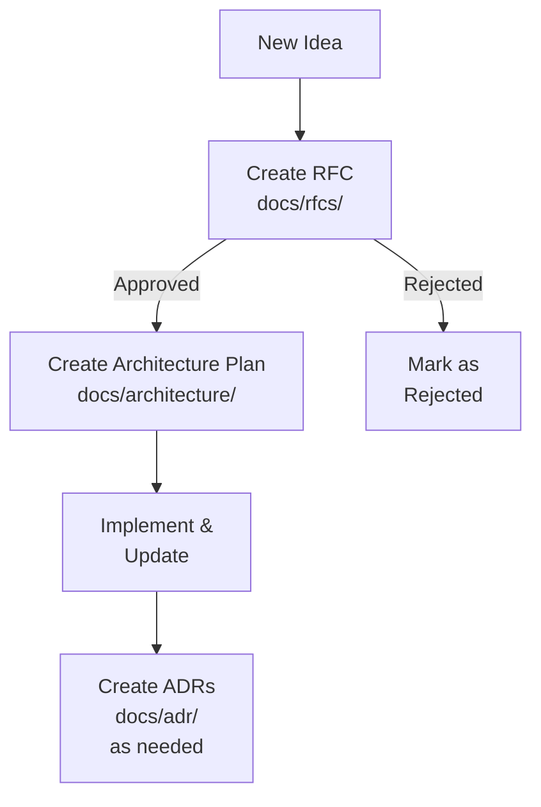

# Documentation

This directory contains technical documentation for the Sage monorepo.

## Documentation Structure

### [RFCs (Request for Comments)](rfcs/README.md)

Proposals for significant system changes that require review and feedback.

- **Purpose**: Gather feedback on proposed designs before implementation
- **Audience**: All stakeholders (engineering, product, architecture)
- **Lifecycle**: Open for Review → Approved/Rejected (stays in `docs/rfcs/` as historical record)

### [Architecture](architecture/README.md)

Architecture plans, design documents, and system diagrams for implementation.

- **Purpose**: Document detailed designs and system architecture
- **Audience**: Engineers implementing features, new team members
- **Lifecycle**: Active → Implemented/Superseded
- **Diagrams**: Stored in `docs/architecture/diagrams/` (supports `.gif`, `.png`, `.svg`, `.html`)

### [ADRs (Architecture Decision Records)](adr/README.md)

Lightweight records of specific architectural decisions.

- **Purpose**: Capture context and rationale for technical decisions
- **Audience**: Current and future engineers
- **Lifecycle**: Immutable once accepted (superseded by new ADRs if needed)

## Documentation Workflow

!!! note "Note on workflow"

    While the diagram shows a linear progression, in practice you may draft architecture plans while developing your RFC to clarify your thinking. However, **only submit the RFC for initial review**. The detailed architecture plan should be **created as a NEW document** in `docs/architecture/` only after the RFC is approved (the RFC remains in `docs/rfcs/` as historical record). This keeps the review process focused and avoids investing heavily in implementation details before gaining consensus on the approach.

## Quick Links

- [RFCs](rfcs/README.md)
- [Architecture Plans](architecture/README.md)
- [ADRs](adr/README.md)

## Submission Process

All technical documents follow a **two-PR workflow**:

1. **PR #1**: Publish document to docs site (quick merge after compliance check)
2. **PR #2**: Collect feedback from team (detailed technical review)

See the **[Documentation Submission Workflow](submission-workflow.md)** for complete step-by-step instructions.

## Contributing

### Creating Documentation

1. **Proposing Changes**: Create an RFC for significant features or system changes
2. **Architecture Plans**: Document approved designs with detailed implementation guidance
3. **Recording Decisions**: Create an ADR for specific technical decisions

### Submission Process

Follow the [two-PR workflow](submission-workflow.md) for all document submissions:

- First PR publishes to docs site
- Second PR collects team feedback

### Maintaining Documentation

- Keep architecture documents current as implementation evolves
- Use clear, concise language
- Include diagrams where helpful (store in `docs/architecture/diagrams/`)
- Link to related documents and issues
- Follow the templates provided in each directory
